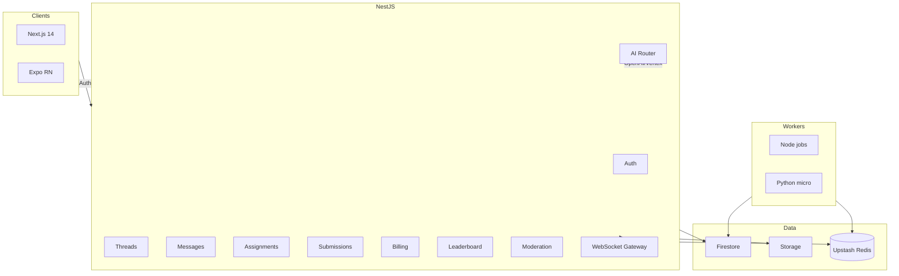

## Architecture

- Auth: Firebase Auth with role claims. API verifies tokens via Admin SDK.
- Realtime: Firestore listeners + API WS for chat/presence.
- Payments: Stripe Checkout; webhook updates entitlements in Firestore.
- Safety: Guardrails in `packages/ai-prompts` enforced in AI Router.